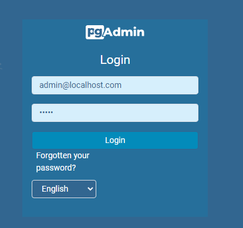
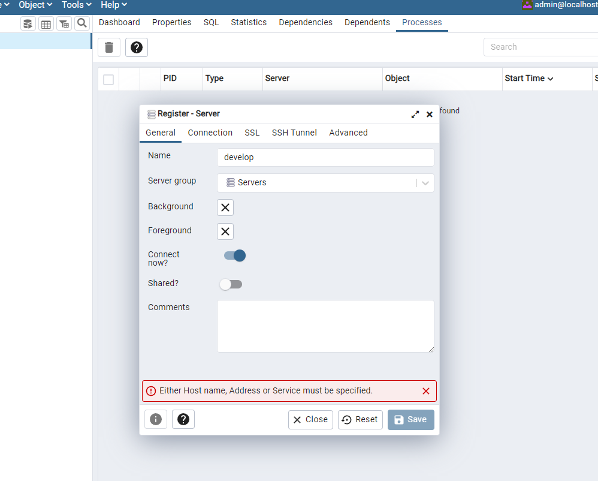
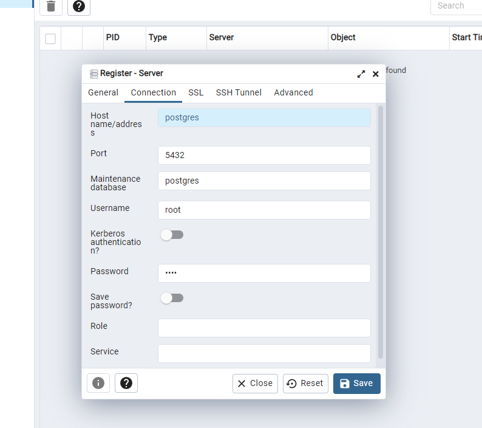

# java-reactive-programming
> The aim of this project is to demonstrate the reactive programming using Spring Webflux and Spring Data R2DBC. 
> Also, new features like cache in memory with Redis will be included in a near future.
> 
> _Coded by [atromilen](https://github.com/atromilen)_

## About technology

**Spring WebFlux**

This reactive-stack web framework was added later in version 5.0 to support fully non-blocking Reactive Streams back 
pressure. Spring WebFlux internally uses [Projec Reactor](https://projectreactor.io/) and its publisher implementations 
[Flux](https://projectreactor.io/docs/core/release/api/reactor/core/publisher/Flux.html) and 
[Mono](https://projectreactor.io/docs/core/release/api/reactor/core/publisher/Mono.html).

**Spring Data R2DBC**

Spring Data R2DBC follows the [Reactive Relational Database Connectivity](https://r2dbc.io/) specification in order to 
integrate SQL database using reactive drivers.

**Wildfly**

This framework is used for database migration, allowing us to remodel our application's database schema in a reliably 
and easy way, having a backup for every change that our database schema suffer in the time.

**Docker utilities**

The project have a docker-compose file that starts all the services needed by this project, such as the **postgres** 
database and the postgres client **pgadmin** (web version). So you won't need to install extra software to run the app,
all is included in the box thanks to docker.

## Prerequisites
1. **Java 11** is the base language used to code this application and you will need to install the jdk 11 to run the app.
2. **Docker** is need to start up the app's related services with docker-compose. Can be found 
[here](https://docs.docker.com/get-docker/).
3. **Make** is required to run the makefile that builds and executes the application. This may be part of some Unix based
OS or can be installed through package managers such as apt-get or be part of development tools like Xcode in mac osx. 
In Windows OS you can install it through some package manager like [Scoop](https://scoop.sh/) or 
[Chocolatey](https://chocolatey.org/).

## Getting Started

1. The first time that you clone this project, you will need to execute the next command:

```bash
make start-from-zero
```
It will start up the docker images required by the application (postgres and pgadmin) and it will run the flyway 
migration scripts over the postgres database.

2. If you only need to start the service containers, enter and execute the command:
```bash
make start
```

3. [Optional] there are two make tasks for stop the service containers. If you want only to stop the service
containers maintaining all the data and configs, enter and execute:
```bash
make stop
```

At the opposite, if you want to stop the service containers, deleting the containers and removing the images
associated from your local docker, execute the next command:
```bash
make stop-and-delete
```

### PgAdmin config
If you want to visualize the database using the web client **PgAdmin** that is provided as service container, open a
browser and go to [localhost:80](localhost:80), entering as credentials **admin@localhost.com**/**admin** as 
user/password respectively.



Next, right click on **_Servers -> register -> Server..._**. In the **General** tab, enter a name for this server 
(I entered "develop" but you can use whatever you want).



In the **Connection** tab, enter the next information:
- Hostname/addres: postgres
- Username: root
- Password: root



The connection information is provided in the file docker-compose. It's important to notice that host must be **_postgres_** 
and not localhost, due you're pointing to the host exposed in the container service called **postgres**.